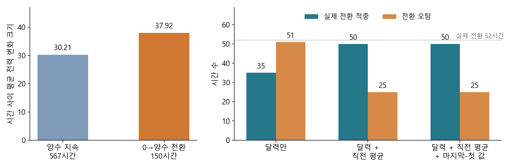
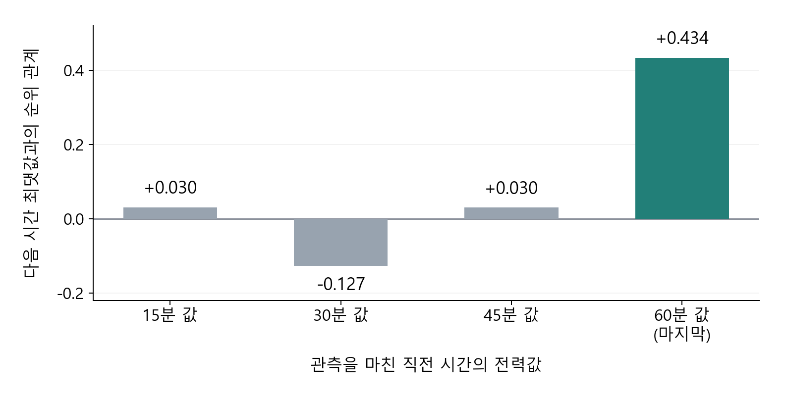

# 3. Analysis

## 3.1 생산량 전환의 전력 변화와 사전 구분

EDA에서 전력의 하루 패턴과 생산 기록에 따른 차이를 확인했다. 이를 바탕으로 생산량이 바뀔 때 전력 변화가 커지는지, 그 전환을 과거 정보로 미리 구분할 수 있는지 분석했다. 대상은 2021년 1 ~ 8월 정상 기록 241일이며, 시간별 평균 전력은 네 15분 값의 산술평균이다. 전력 변화 크기는 현재와 정확히 한 시간 전 평균 전력 차이의 절댓값으로 계산했다.

연속된 5,781시간에서 생산량 유지 기록 2,296시간 중 2,292시간은 직전·현재 생산량이 모두 0이었다. 단순한 증가·감소·유지 비교에는 이 구성 차이가 섞이므로, 생산량 0→양수 전환과 양수 지속을 구분했다. 두 집단이 각각 최소 두 날짜에 관측된 공통 46개 월·시간대·평일/주말 조건에서, 조건별 평균에 두 집단을 합친 시간 수를 같은 가중치로 적용했다. 비교 대상은 전환 150시간과 양수 지속 567시간이며, 전체 전환 215시간의 69.8%가 포함됐다. 기록상의 전환을 실제 설비 재가동으로 해석하지 않았다.

**0→양수 전환의 평균 전력 변화 크기는 37.92로, 양수 지속의 30.21보다 25.5% 컸다.** 직전 전력 대비 상대 변화율도 53.70%와 33.25%였고, 직전 전력이 낮은 구간(20 ~ 26)을 제외해도 53.75%와 33.53%로 방향이 유지됐다. 상대 변화율은 작은 분모의 영향을 점검한 보조 지표이며, 두 집단의 직전 전력 수준을 동일하게 맞춘 결과는 아니다. 월을 하나씩 제외한 절대 변화 차이도 +6.54 ~ +9.20이었다. 반면 양수 생산량끼리의 증감 크기와 전력 변화 크기의 조건부 순위 관계는 −0.006으로 약해, 모든 생산량 변화로 결과를 확대하지 않았다.

다음으로 현재 생산량이 0인 기록에서, 이미 관측한 전력으로 다음 시간의 양수 전환을 구분했다. 1 ~ 4월 학습, 5 ~ 6월 모형·판정 기준 결정, 7 ~ 8월 고정 평가 순서로 같은 트리 분류모형의 입력을 비교했다. 달력 정보에 직전 평균 전력, 다시 직전 시간의 마지막−첫 15분 값을 추가했으며, 목표 시간의 실제 생산량·전력은 입력에 넣지 않았다.

*왼쪽은 같은 달력 조건의 전력 변화 크기다. 오른쪽은 7 ~ 8월 생산량 0인 617시간 중 실제 전환 52시간의 적중·오탐이다. 두 패널은 서로 다른 분석 표본과 지표를 사용한다.*

**달력만 사용하면 52건 중 35건을 찾고 51건을 잘못 판정했으나, 직전 평균 전력 추가 후에는 50건 적중·25건 오탐으로 개선됐다.** 재현율은 67.3%→96.2%, 정밀도는 40.7%→66.7%였다. 확률 순위의 정밀도·재현율을 요약한 AP도 0.377→0.902였고, 7월·8월 및 반복 배열 보조 점검에서 개선 방향이 유지됐다. 마지막−첫 값을 추가한 AP는 0.904였지만 적중·오탐은 같아 추가 이득은 작았다.

생산량 0→양수 전환은 전력 변동의 별도 평가 조건이며, 이미 관측한 평균 전력은 전환 구분의 입력 후보가 된다. 다만 이는 입력 가치의 탐색적 검증이다. EDA에서도 본 기간의 결과를 새로운 독립 시험이나 실제 전력 예측 성과로 확대하지 않으며, 전환 시간의 예측오차 개선은 Modeling에서 확인한다.

이미지·생성 코드: [통합 그림](figures/a01_a02_transition_summary.png) · [plot_analysis_transition_summary.py](scripts/plot_analysis_transition_summary.py)의 `main()`.

관련 Python: [전환 비교](scripts/a01_production_changes.py) · [상대 변화율](scripts/a01_relative_changes.py) · [전환 분류](scripts/a02_transition_forecast.py). 근거: [전력 변화 분석 기록](10.03_A01_생산량증감과전력변동_분석기록.md) · [사전 구분 기록](10.03_A02_발전_전환사전구분과전력예측_분석기록.md).

## 3.2 날씨 정보의 추가 가치 검토

EDA에서 8월 기온·전력 관계가 생산 조건에 따라 달랐으므로, 월·시간대·생산 기록·다른 기상변수를 고려한 뒤에도 관계가 남는지 확인했다. 네 기상변수가 모두 있는 평일 171일·4,102시간에서 동일한 기록의 평균 전력과 순위 관계를 비교했다.

| 기상변수 | 단순 순위 상관 | 조건 고려 후 관계 |
|---|---:|---:|
| 기온 | +0.227 | −0.004 |
| 풍속 | +0.195 | +0.046 |
| 습도 | −0.102 | +0.100 |
| 강수량 | +0.057 | −0.060 |

*단순 관계는 Spearman 상관, 조건 고려 후 관계는 각 조건으로 설명되는 순위 차이를 제거한 부분 순위 관계다.*

전체 기간의 조건부 관계는 약했다. 8월 생산량 양수인 평일 360시간·17일에서는 기온 관계가 +0.302였지만, 날짜별 차이까지 고려하면 +0.014로 약해졌다. 기온과 전력이 함께 높은 날짜의 경향을 같은 날 안의 관계로 확대하기 어려웠다. 따라서 과거 전력 입력을 우선 비교하고, 날씨의 추가 가치는 이용 가능한 과거 기상정보를 더했을 때 예측오차가 줄어드는지로 판단한다. 이 관계 분석만으로 비선형 예측 가치를 배제하지 않는다.

관련 Python: [조건부 날씨 관계](scripts/a03_conditioned_weather.py) · [날짜별 보조 점검](scripts/a03_weather_diagnostics.py). 근거: [분석 기록](10.03_A03_생산조건을고려한날씨전력관계_분석기록.md) · [동일 기록 비교표](tables/a03_conditioned_weather/common_row_associations.csv). 보조 이미지·생성 코드: [날씨 그림](figures/a03_weather_conditions.png) · [plot_a03_weather.py](scripts/plot_a03_weather.py)의 `main()`.

## 3.3 다음 시간 최대전력과 마지막 15분 값

큰 전력 변화가 높은 최대전력도 뜻하는지 확인했다. 시간별 최대전력은 네 15분 값의 최댓값으로 정의하고 연속값으로 분석했다. 3.1과 같은 46조건·717시간에서 생산량 0→양수 전환과 양수 지속의 최대전력은 135.73과 135.32로 차이가 작았다. **생산 전환의 큰 변화와 높은 최대전력은 구분해야 했다.**

이어 정확히 연속된 세 시간의 기록이 있는 5,778시간에서, 관측을 마친 시간의 네 전력값과 다음 시간 최대전력의 부분 순위 관계를 비교했다. 목표 시간의 달력 정보와 직전 생산량·평균 전력을 고려했으며, 목표 시간의 실제 생산량·전력은 조건에 넣지 않았다.

*같은 5,778시간에서 달력·과거 생산량·평균 전력을 고려한 순위 관계다. 수치는 예측 정확도나 오차 개선률을 뜻하지 않는다.*

**마지막 15분 값의 관계는 +0.434로 다른 세 구간보다 컸고, 직전 최대값까지 고려해도 +0.409로 남았다.** 후자의 기간별 관계는 1 ~ 4월 +0.394, 5 ~ 6월 +0.430, 7 ~ 8월 +0.390이었으며, 반복 배열의 비중을 낮춰도 +0.374였다. 평균·최대 수준만으로 설명되지 않는 마지막 값의 정보가 관측된 것이다.

다만 과거 평균값과 달력·생산량 0 여부를 정확히 맞춘 비교에는 1,039시간만 남았고, 71.5%가 낮은 전력 구간이었다. 이 비교의 1 ~ 4월 관계는 −0.009로 거의 없어 모든 조건에서 같은 정보를 준다고 일반화하지 않았다.

Modeling에서는 과거 평균·최대에 마지막 15분 값을 추가해 다음 시간 최대전력을 직접 예측하는 방법을 비교한다. 전체 오차와 실제 일별 최대시간의 과소·과대예측을 함께 평가하며, 과대예측을 크게 늘려 얻은 과소예측 감소는 개선으로 채택하지 않는다. 목표 시간의 실측 생산량·날씨는 입력에 쓰지 않고 실제 예측 개선은 시간순 검증으로 확인한다.

이미지·생성 코드: [네 구간 비교 그림](figures/a04_terminal_slots.png) · [plot_a04_terminal_slots.py](scripts/plot_a04_terminal_slots.py)의 `main()`.

관련 Python: [최대전력 조건 비교](scripts/a04_maximum_conditions.py) · [평균·최대 고려 후 관계](scripts/a04_terminal_unique.py) · [엄격 비교의 표본 점검](scripts/a04_support_diagnostics.py). 근거: [분석 기록](10.03_A04_다음시간최대전력과선행정보_분석기록.md). 전체 재현 코드와 실행 순서는 [Analysis 재현 안내](README.md)에 정리했다.
