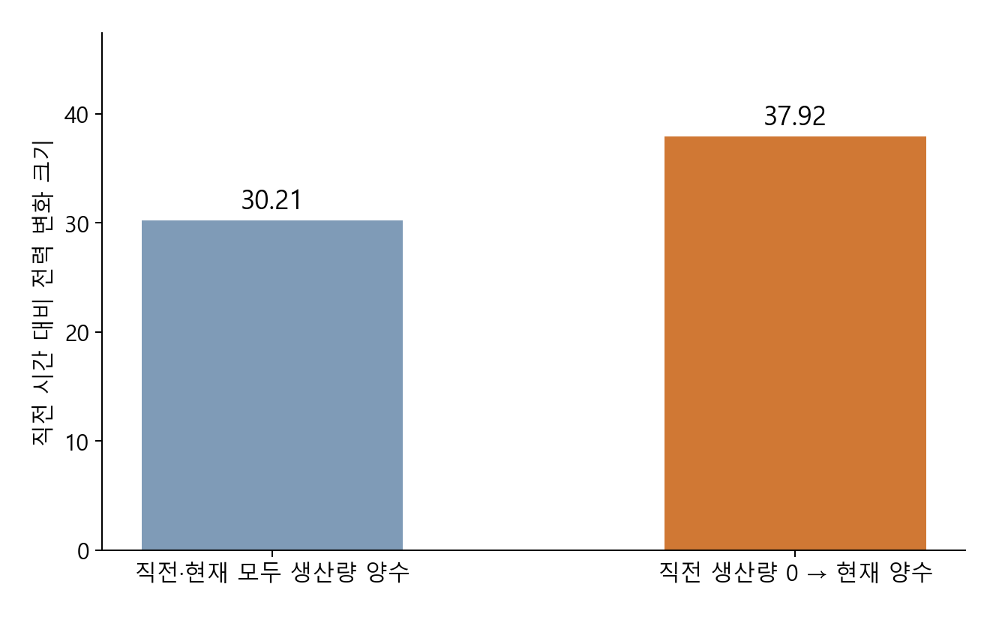

# 3. Analysis

## 3.1 생산량 전환에 따른 시간 사이 전력 변화

EDA에서는 평일 12시 전력 하락과 13시 상승이 147/171일에서 반복됐고, 같은 시간대의 전력 수준도 월과 생산량 기록에 따라 달랐다. 이러한 반복 패턴을 고려해, 생산량이 변할 때 전력의 변화 크기도 달라지는지 비교했다. 2021년 1 ~ 8월 정상 기록 241일 중 정확히 1시간 전 기록과 연결되는 5,781시간을 사용했다. 시간별 전력은 네 15분 값의 평균으로 계산하고, 현재와 직전 평균 전력 차이의 절댓값을 ‘시간 사이 전력 변화 크기’로 정의했다. 상승과 하락이 상쇄되지 않도록 변화의 크기를 비교한 것이다.

**생산량 증가·감소·유지만 나누면 생산량 0인 기록의 영향이 섞였다.** 생산량 유지 2,296시간 중 2,292시간(99.83%)은 직전과 현재 생산량이 모두 0이었다. 양수 생산량이 같은 값으로 유지된 기록은 4시간뿐이어서, 증가·감소와 유지의 차이를 생산량 증감 자체의 영향으로 해석하기 어려웠다. 이에 직전과 현재 생산량이 모두 양수인 경우와, 0에서 양수로 바뀐 경우를 구분했다. 여기서 0→양수는 기록상의 전환을 뜻하며 실제 설비 재가동을 의미하지 않는다.

두 집단의 시간대 구성이 다르면 반복되는 전력 상승·하락이 비교 결과에 섞일 수 있다. 따라서 **같은 월·시간대·평일/주말 안에서 두 집단을 비교**했다. 각 집단에 최소 두 날짜가 있는 공통 46조건을 남기고, 조건별 평균에 두 집단이 합쳐진 시간 수를 동일한 가중치로 적용했다. 비교에는 0→양수 전환 150시간과 양수가 이어진 567시간이 포함됐다. 0→양수 전체 215시간 중 69.8%가 포함된 결과이며, 양수 지속 전체 3,060시간의 평균과는 구분된다.

이미지 파일: [Analysis/figures/a01_production_transition.png](<figures/a01_production_transition.png>). 생성 코드: [plot_a01_production_changes.py](<scripts/plot_a01_production_changes.py>)의 `main()`.

*막대는 같은 달력 조건으로 구성을 맞춘 평균이다. ‘직전·현재 생산량 모두 양수’와 ‘직전 생산량 0→현재 양수’를 비교하며, 세로축은 현재와 직전 평균 전력의 절대 차이를 나타낸다. 전력값은 원자료의 척도를 사용했다.*

**0→양수 전환에서 평균 전력 변화 크기는 37.92로, 양수가 이어진 기록의 30.21보다 7.71, 약 25.5% 컸다.** 같은 비교에서 한 시간 안의 네 15분 값의 최대·최소 차이는 22.90과 21.37로 차이가 1.53이었다. 따라서 이 전환에서 두드러진 특징은 이전 시간과 현재 시간 사이의 전력 수준 변화였다.

직전 전력 수준에 대비한 변화도 함께 확인했다. 각 시간의 절대 변화 크기를 직전 전력으로 나눈 상대 변화율을 계산한 뒤, 동일한 717시간과 달력 조건으로 비교했다. 평균 상대 변화율은 **0→양수 전환 53.70%, 양수 지속 33.25%로 20.45%p 차이**였다. 작은 분모에만 결과가 의존하는지 확인하기 위해 EDA에서 구분한 낮은 전력 구간 20 ~ 26을 직전 전력에 적용해 보조 점검했다. 이 구간을 제외해도 53.75%와 33.53%로 방향이 유지됐다. 기본 비교에는 직전 전력이 0인 기록이 없었다. 절대 변화와 상대 변화에서 모두 차이가 나타났지만, 상대 변화율 계산이 두 집단의 직전 전력 수준을 동일하게 맞춘 것은 아니다.

월을 하나씩 제외한 비교에서도 절대 변화 크기 차이는 +6.54 ~ +9.20으로 유지됐다. 반복되는 하루 전력 배열의 비중을 낮추거나 같은 날짜 안의 직전 기록만 비교해도 방향은 같았다. 반면 직전·현재 생산량이 모두 양수인 기록에서, 달력 조건을 고려한 생산량 변화 크기와 전력 변화 크기의 순위 관계는 −0.006으로 약했다. 양수→0 전환에서도 0→양수와 같은 추가 차이가 일관되게 나타나지 않아, 모든 생산량 전환으로 결과를 확대하지 않았다.

이 결과는 전력 변동을 설명할 때 **생산량 0→양수 전환을 별도 조건으로 살펴볼 근거**가 된다. 예측 단계에서는 해당 전환 시간에 오차와 과소예측이 집중되는지 먼저 확인하고, 예측 시점에 알 수 있는 과거 생산량·전력과 달력 정보로 이를 줄일 수 있는지 평가한다. 목표 시간의 실제 생산량으로 구분한 전환은 사후 평가에 사용하며, 이를 미리 아는 입력으로 넣지 않는다. 이번 분석에서 확인한 것은 관측된 전력 변화의 차이이며, 예측 개선 효과는 시간순 평가에서 별도로 검증한다.

근거: [분석 조건·해석·검증 기록](10.03_A01_생산량증감과전력변동_분석기록.md) · [생산량 전환별 비교](tables/a01_production_changes/transition_matched_contrasts.csv) · [상대 변화율 보조 점검](tables/a01_production_changes/relative_contrasts.csv) · [양수 생산량 내 관계](tables/a01_production_changes/positive_production_correlations.csv)

**관련 Python 코드**

- [Analysis/scripts/a01_production_changes.py](<scripts/a01_production_changes.py>): `load()`로 정확한 시간 연결과 전력 지표를 구성하고, `contrast()`·`followup()`으로 같은 달력 조건의 전환 비교와 월·반복 배열 보조 점검을 수행한다.
- [Analysis/scripts/a01_relative_changes.py](<scripts/a01_relative_changes.py>): `main()`에서 직전 전력 대비 상대 변화율과 낮은 전력 구간 제외 결과를 비교한다.
- [Analysis/scripts/plot_a01_production_changes.py](<scripts/plot_a01_production_changes.py>): 저장된 전환 비교표로 위 그림을 생성한다.

## 3.2 과거 전력 정보와 생산량 전환의 사전 구분

3.1에서는 생산량이 0에서 양수로 바뀐 시간의 전력 변화가 더 컸다. 그러나 이 전환은 해당 시간의 실제 생산량을 확인한 뒤 구분한 조건이다. 이번에는 **현재 생산량이 0일 때, 이미 관측한 전력으로 다음 시간의 양수 전환을 미리 구분할 수 있는지** 확인했다. 전환 시점의 전력 변화 크기를 설명하는 것과 전환 발생 여부를 구분하는 것은 다른 질문이므로, 현재 생산량이 0인 기록에서 다음에도 0인 경우와 다음에 양수로 바뀌는 경우를 비교했다.

입력 정보의 가치는 전환 구분용 분류모형의 시간순 검증으로 비교했다. 1 ~ 4월로 학습하고 5 ~ 6월에서 모형과 전환 판정 기준을 정한 뒤, 7 ~ 8월에 그대로 적용했다. 입력은 ① 다음 시간의 달력 정보(시간대·평일/주말·월), ② 여기에 관측을 마친 시간의 평균 전력 추가, ③ 다시 그 시간의 마지막−첫 15분 값 추가로 나눴다. 세 경우에 같은 트리 분류모형을 사용했고, 다음 시간의 실제 생산량·전력은 입력에 넣지 않았다. 이는 분석에서 사용할 정보의 가치를 비교하는 탐색적 검증이며, 다음 시간 전력값을 예측하는 모형의 성능 평가와는 구분된다.

7 ~ 8월 평가 대상은 현재 생산량이 0인 617시간이었고, 이 중 다음 시간에 양수로 전환한 기록은 52시간(8.43%)이었다.

이미지 파일: [Analysis/figures/a02_transition_detection.png](<figures/a02_transition_detection.png>). 생성 코드: [a02_transition_review.py](<scripts/a02_transition_review.py>)의 `main()`.

*파란 막대는 실제 전환을 찾아낸 시간 수, 주황 막대는 전환으로 잘못 예상한 시간 수다. 점선은 실제 전환 전체 52시간이다. 각 입력의 판정 기준은 5 ~ 6월 검증에서 정하고 7 ~ 8월 평가에서 변경하지 않았다.*

**달력만으로는 실제 전환 52시간 중 35시간을 찾아냈지만, 직전 평균 전력을 추가하면 50시간을 찾아냈다.** 전환으로 잘못 예상한 시간도 51시간에서 25시간으로 줄었다. 실제 전환을 찾아낸 비율인 재현율은 67.3%에서 96.2%로 높아졌고, 전환이라고 판정한 기록 중 실제 전환의 비율인 정밀도는 40.7%에서 66.7%로 높아졌다. 전환을 더 많이 찾아내면서 잘못된 판정도 줄인 결과다. 다만 과거 전력을 사용해도 전환으로 판정한 75시간 중 25시간은 실제로 전환하지 않았다.

확률 순위에 따른 정밀도·재현율을 요약한 AP도 달력만 사용하면 0.377, 직전 평균 전력을 추가하면 0.902였다. 과거 평균 전력을 추가한 AP는 7월 0.906, 8월 0.898로 두 월 모두 달력만 사용한 결과보다 높았다. 반복 전력 배열의 비중을 낮춘 보조 점검에서도 같은 방향이 유지됐다. **전환 구분의 큰 이득은 시간대에 더해 이미 관측한 평균 전력 수준을 사용했을 때 나타났다.**

시간 안의 마지막−첫 값을 더하면 AP는 0.904로 소폭 높아졌지만, 실제 전환 적중 50시간과 오탐 25시간은 같았다. 따라서 이 비교에서 시간 안의 변화가 전환 구분에 큰 추가 정보를 주었다고 해석하지 않았다. 앞서 이 값은 전체 기록의 다음 시간 전력 변화와 연결됐지만, 전력 변화의 크기를 설명하는 정보와 생산량 전환 여부를 구분하는 정보의 유용성은 달랐다.

이 결과는 현재 생산량이 0이라는 기록만으로 다음 시간의 상태를 판단하기보다 **이미 관측한 전력 수준을 함께 사용해 전환 가능성을 표현할 근거**가 된다. 실제 생산량 전환을 미리 안다고 가정하지 않고도 과거 정보로 전환 여부를 구분하는 데 도움을 얻었다. 전환 가능성을 전력 예측에 어떻게 반영할지와 실제 전력 예측오차가 줄어드는지는 Modeling에서 별도로 다룬다. 현재 기간은 EDA에서도 살펴본 자료이므로 시간순 검증 결과를 새로운 독립 시험이나 실제 운영 성능으로 확대하지 않는다.

근거: [전환 구분·검증 조건과 해석](10.03_A02_발전_전환사전구분과전력예측_분석기록.md) · [모형·판정 기준 고정](tables/a02_transition_forecast/frozen.json) · [시간순 평가 결과](tables/a02_transition_forecast/classification_test.csv) · [반복 배열 보조 점검](tables/a02_transition_forecast/repetition_sensitivity.csv)

**관련 Python 코드**

- [Analysis/scripts/a02_prior_power_signals.py](<scripts/a02_prior_power_signals.py>): `build()`로 연속 세 시간의 관측·과거 입력을 구성하고, `association()`으로 앞선 전력 변화 관계를 계산한다.
- [Analysis/scripts/a02_signal_diagnostics.py](<scripts/a02_signal_diagnostics.py>): 과거 전력 수준 조정 방식과 같은 수준의 비교 가능한 기록을 점검한다.
- [Analysis/scripts/a02_transition_forecast.py](<scripts/a02_transition_forecast.py>): `class_validation()`에서 입력·모형·판정 기준을 검증하고, `final_evaluation()`에서 고정한 조건으로 7~8월 전환 구분 결과를 계산한다. 같은 파일의 전력 회귀 실험은 이 절의 전환 구분 성과와 별개다.
- [Analysis/scripts/a02_transition_review.py](<scripts/a02_transition_review.py>): 저장된 전환 확률로 반복 배열 보조 점검을 수행하고 적중·오탐 그림을 생성한다.

## 3.3 날씨 관계와 예측 입력의 검토

과거 전력 정보에 더해 날씨를 예측 입력으로 검토할 근거를 확인했다. EDA에서 8월 기온·전력 관계가 생산량 조건에 따라 달랐으므로, 네 기상변수가 모두 관측된 평일 171일·4,102시간에서 월·시간대·생산 기록·다른 기상변수를 고려하기 전후의 순위 관계를 비교했다. 전력은 네 15분 값의 평균을 사용했다.

이미지 파일: [Analysis/figures/a03_weather_conditions.png](<figures/a03_weather_conditions.png>). 생성 코드: [plot_a03_weather.py](<scripts/plot_a03_weather.py>)의 `main()`.

| 기상변수 | 단순 순위 상관 | 조건을 고려한 뒤 남은 관계 |
|---|---:|---:|
| 기온 | +0.227 | −0.004 |
| 풍속 | +0.195 | +0.046 |
| 습도 | −0.102 | +0.100 |
| 강수량 | +0.057 | −0.060 |

*단순 관계는 Spearman 상관, 조건을 고려한 관계는 해당 조건으로 설명되는 순위 차이를 제거한 뒤 계산한 부분 순위 관계다. 두 열은 동일한 4,102시간을 비교한다.*

전체 기간에서는 조건을 고려한 관계가 약했다. 8월의 생산량 양수인 평일 360시간·17일에서는 기온 관계가 +0.302로 남았지만, 날짜별 차이까지 고려하면 +0.014로 약해졌다. 따라서 기온이 높은 날짜에 전력도 높은 경향을 같은 날 안의 기온 상승과 전력 상승 관계로 확대하기 어려웠다.

이 결과만으로 날씨의 예측 가치를 배제할 수는 없다. 다만 단순 상관을 근거로 큰 예측 개선을 기대하기 어려워, 예측에서는 3.1·3.2에서 확인한 과거 전력 정보의 활용을 우선 비교한다. 날씨의 추가 가치는 예측 시점에 이용 가능한 과거 기상정보를 더했을 때 오차가 줄어드는지로 판단한다. 목표 시간의 실측 날씨와 생산량을 미리 아는 입력으로 사용하지 않는다.

근거: [날씨 관계의 조건·월·날짜별 점검](10.03_A03_생산조건을고려한날씨전력관계_분석기록.md) · [동일 기록 비교](tables/a03_conditioned_weather/common_row_associations.csv) · [날짜별 차이 점검](tables/a03_conditioned_weather/temperature_monthly_diagnostics.csv)

**관련 Python 코드**

- [Analysis/scripts/a03_conditioned_weather.py](<scripts/a03_conditioned_weather.py>): `prepare()`·`association()`으로 생산 기록과 달력·기상 조건을 고려한 순위 관계를 계산한다.
- [Analysis/scripts/a03_weather_diagnostics.py](<scripts/a03_weather_diagnostics.py>): `main()`에서 동일한 기록의 전후 관계를 비교하고, `adjusted()`로 날짜별 차이와 생산량 조정 방식의 영향을 점검한다.
- [Analysis/scripts/plot_a03_weather.py](<scripts/plot_a03_weather.py>): 동일한 평일 4,102시간의 비교표로 위 그림을 생성한다.

## 3.4 다음 시간 최대전력과 마지막 15분 값의 관계

3.1에서 확인한 큰 전력 변화가 높은 최대전력도 뜻하는지 살펴봤다. 목표 시간의 네 15분 값 중 최댓값을 ‘시간별 최대전력’으로 정의하고 연속값으로 비교했다. 3.1과 같은 46조건·717시간에서 생산량 0→양수 전환의 최대전력은 135.73, 양수 지속은 135.32로 차이가 작았다. **생산 전환에 따른 큰 변화와 높은 최대전력은 구분해야 했다.**

다음으로 관측을 마친 시간의 어떤 전력값이 다음 시간 최대전력과 연결되는지 확인했다. 정확히 연속된 세 시간의 기록이 있는 5,778시간에서, 목표 시간의 월·시간대·평일/주말과 직전 생산량·평균 전력을 고려한 부분 순위 관계를 비교했다. 목표 시간의 실제 생산량과 평균 전력은 조건에 넣지 않았다.

이미지 파일: [Analysis/figures/a04_terminal_slots.png](<figures/a04_terminal_slots.png>). 생성 코드: [plot_a04_terminal_slots.py](<scripts/plot_a04_terminal_slots.py>)의 `main()`.

*네 막대는 동일한 5,778시간에서 계산한 부분 순위 관계다. 월·시간대·평일/주말, 직전 생산 기록과 평균 수준을 고려했다. 값은 예측 정확도나 오차 개선률을 뜻하지 않는다.*

**마지막 15분 값의 관계는 +0.434로, 다른 세 구간보다 컸다.** 직전 최대값까지 고려해도 +0.409로 남았고, 이 비교의 기간별 관계는 1 ~ 4월 +0.394, 5 ~ 6월 +0.430, 7 ~ 8월 +0.390이었다. 반복 전력 배열의 비중을 낮춘 결과도 +0.374로 양의 방향이 유지됐다. 평균·최대 수준만으로 설명되지 않는 마지막 값의 관계가 관측된 것이다.

다만 과거 평균값과 달력·생산량 0 여부를 정확히 맞춘 비교에는 1,039시간만 남았고, 이 중 71.5%는 EDA의 낮은 전력 구간이었다. 해당 비교의 1 ~ 4월 관계는 −0.009로 거의 없었다. 비교 가능한 기록의 구성도 달라졌으므로, 마지막 값이 모든 조건에서 같은 정보를 준다고 일반화하지 않았다.

이 결과를 바탕으로 Modeling에서는 **과거 평균·최대에 마지막 15분 값을 추가해 다음 시간 최대전력을 직접 예측하는 방법**을 비교한다. 전체 오차와 실제 일별 최대전력 시간의 과소·과대예측을 함께 평가하고, 과대예측을 크게 늘려 과소예측만 줄이는 결과를 개선으로 채택하지 않는다. 이번 분석은 예측 입력 후보의 근거이며, 실제 최대전력의 과소예측 감소는 시간순 예측 검증에서 확인한다.

근거: [최대전력 조건·선행정보와 예외 점검](10.03_A04_다음시간최대전력과선행정보_분석기록.md) · [생산조건별 최대값 비교](tables/a04_maximum_conditions/matched_contrasts.csv) · [평균·최대 고려 후 관계](tables/a04_maximum_conditions/terminal_unique_information.csv) · [엄격 비교의 표본 구성](tables/a04_maximum_conditions/exact_mean_support.csv)

**관련 Python 코드**

- [Analysis/scripts/a04_maximum_conditions.py](<scripts/a04_maximum_conditions.py>): `build()`로 다음 시간 최대값과 과거 입력을 구성하고, `matched()`·`association()`으로 생산 전환별 최대값과 선행 관계를 비교한다.
- [Analysis/scripts/a04_maximum_diagnostics.py](<scripts/a04_maximum_diagnostics.py>): `daily_priorities()`·`maximum_context()`로 일별 최대 시간과 평균·최대 차이를 점검하고, `slot_group_associations()`로 네 구간의 관계를 비교한다.
- [Analysis/scripts/a04_terminal_unique.py](<scripts/a04_terminal_unique.py>): `compare()`로 과거 평균·최대까지 고려한 마지막 값의 추가 관계와 기간별 안정성을 확인한다.
- [Analysis/scripts/a04_support_diagnostics.py](<scripts/a04_support_diagnostics.py>): 같은 과거 평균을 정확히 맞춘 비교의 표본 구성과 초기 기간의 예외를 점검한다.
- [Analysis/scripts/plot_a04_terminal_slots.py](<scripts/plot_a04_terminal_slots.py>): 저장된 네 구간 비교표로 위 그림을 생성한다.
