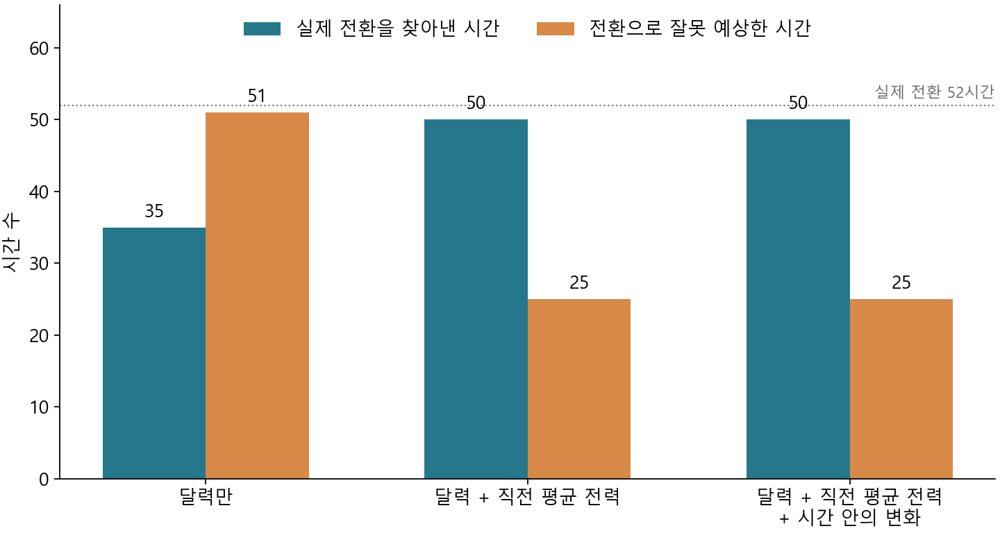

# 3.2 발전 실행 기록 — 전환을 미리 구분하고 전력 예측에 연결할 수 있는가?

후속 상태(2026-10-03): 사용자 요청으로 [3.2 원고](03_Analysis_원고.md)를 작성했다. 원고에는 전환 사전 구분의 입력 비교·적중·오탐·한계를 담고, 아래 전력 예측 성능 실험은 Modeling에 넘길 선행 실행 기록으로 구분했다. 아래 원고 미작성 표현은 계산 당시 상태다. 새 계산·추가 학습은 하지 않았다.

2026-10-03. 사용자 승인으로 3.2의 전환 사전 구분과 전력 예측 연결을 실행했다. 현재 데이터와 새 3.1·3.2 결과만 사용했다. 백업·이전 모델·새 피크 기준은 사용하지 않았다. 이번 파일은 분석·평가 기록이며 3.2 보고서 원고는 아직 작성하지 않았다.

## 1. 이전 결과 → 질문 수정

[앞선 3.2](10.03_A02_과거전력과다음시간변화_분석기록.md)는 시간 안의 마지막−첫 15분 값과 다음 전력 변화가 전체에서 연결되지만, 실제 0→양수로 전환한 기록 안에서는 관계가 +0.013으로 약하다고 확인했다. 이는 전환한 기록들 사이의 변화 크기 관계이며 전환 여부를 미리 구분하는 능력은 아니다. 같은 달력 조건의 전환 전 평균 전력이 81.85, 0이 이어지는 기록은 39.57이었던 차이를 후속 질문의 근거로 삼았다.

**새 질문:** 현재 생산량이 0일 때, 이미 관측한 전력으로 다음 시간의 양수 전환을 달력만 사용하는 것보다 잘 구분할 수 있는가? 전환 확률을 전력 예측에 연결하면 전체 오차와 전환 시간의 과소예측이 함께 개선되는가?

## 2. 결과를 보기 전에 고정한 평가

- 기존 3.2의 정확한 연속 세 시간 5,778개 관측을 사용했다. 입력은 관측을 마친 시간의 전력·생산량과 그 이전 전력, 다음 시간의 달력 정보다. 목표 시간의 실제 전력·생산량은 입력으로 쓰지 않았다. 실제 보고 지연은 현 자료에서 미식별이며 이미 관측을 완료한 기록을 사용할 수 있다고 가정한다.
- 전환 구분은 직전 생산량이 0인 2,506시간에서 수행했다. 다음 생산량 양수는 전환, 다음에도 0은 비전환이다. 실제 생산량은 학습 정답·사후 평가에만 쓴다.
- **1~4월 학습 → 5~6월 검증 → 7~8월 마지막 평가**를 고정했다. 검증에서 모형 종류와 판정 기준을 결정하고 마지막 평가 후 바꾸지 않았다.
- 이 기간은 EDA·3.1·기존 3.2에서 이미 관찰했다. 시간순으로 모형을 학습·평가했지만 완전히 새 독립 시험 또는 실제 운영 검증이라고 부르지 않는다.
- 전환 구분 입력은 달력(시간대·평일/주말·월), 달력+직전 평균 전력, 여기에 직전 시간의 마지막−첫 15분 값을 추가한 세 경우다.
- 고정 로지스틱 모형과 고정 작은 트리 모형을 검증에서 비교했다. 풍부한 입력의 검증 AP가 높은 종류를 선택하고, 입력 비교에는 같은 종류를 사용했다. AP가 최고값과 0.01 이내이면 단순한 입력을 우선하는 규칙을 적용했다. 확률 판정 기준은 검증 F1이 최대인 값으로 고정했다. 여러 피크·전환 크기 기준을 탐색하지 않았다.
- AP는 예측 확률 순위에 따른 정밀도·재현율을 요약하는 값으로 정확도와 다르다. 확률 오차는 Brier 점수로 비교하며 작을수록 좋다. 판정한 전환의 적중·오탐 수도 함께 남긴다.
- 전력 예측은 고정 트리 회귀 모형으로 다음 시간 평균 전력을 추정했다. 기준 입력은 달력·직전/그 이전 평균 전력·과거 생산량과 그 0 여부다. 여기에 직접 시간 안의 변화, 다시 전환 확률을 추가한 비교를 수행했다.
- 전력 학습에 쓰는 전환 확률은 해당 시간의 정답으로 학습한 모형의 확률이 아니다. 3~6월 각각의 확률은 앞선 월만으로 학습한 전환 모형으로 계산했다. 7~8월 확률은 1~6월 학습 모형으로 계산했다. 관측한 생산량이 양수이면 전환 확률은 0으로 두되 이미 아는 생산량 0 여부를 별도 입력으로 유지했다.
- 전력 검증은 3~4월 학습·5~6월 평가, 마지막 비교는 3~6월 학습·7~8월 평가다. 전체 시간·실제 전환 시간의 MAE, 평균 과소예측량, 월별 결과를 같은 행에서 비교했다.

## 3. 검증 결과와 한 번의 구조 변경

5~6월의 전환 구분 대상 530시간에는 실제 전환 54시간이 있었다. 작은 트리 모형의 AP는 달력만 0.412, 평균 전력 추가 0.828, 시간 안의 변화 추가 0.851이었다. Brier 점수는 각각 0.0725·0.0364·0.0360이었다. 로지스틱 모형에서도 과거 평균 전력 추가의 이득이 나타났지만 시간 안의 변화 추가 효과는 작았다. 검증 규칙으로 작은 트리·전체 세 입력을 선택하고 전력 연결을 진행했다.

그러나 전환 확률을 변수 하나로 추가한 전력 모형은 실제 전환 54시간의 MAE가 기준 8.51에서 9.95로 악화됐다. 직접 시간 안의 변화를 추가한 경우도 9.02였다. 전체 시간 MAE는 각각 기준 6.15, 직접 변화 5.67, 확률 추가 5.79였다. 전체 개선과 전환 시간 개선은 같은 결과가 아니었다.

**추가 선택 이유:** 전환 확률을 중복 변수로 추가하는 대신 기록 조건별 전력을 추정해 연결하는 구조를 한 번만 비교했다. 현재 생산량이 0인 학습 기록에서 다음에도 0인 경우와 다음에 양수인 경우의 전력 모형을 따로 학습하고, 예측 시점에는 과거 정보의 전환 확률로 두 예측을 가중 평균했다. 미래 생산량으로 실제 가지를 고르는 방식이 아니다. 이미 생산량이 양수인 시간은 직접 변화 모형의 예측을 사용했다.

이 확률 혼합 방식은 검증 전환 시간 MAE 24.65, 전체 MAE 6.75로 좋지 않았다. 구조 변경은 채택 근거를 얻지 못했다. 네 모형의 비교를 모두 고정하고 7~8월을 평가했으며 이후 설정을 바꾸지 않았다. 실패한 방식도 기록하고 유리한 결과를 얻기 위한 추가 구조·변수·임계값 탐색은 종료했다.

## 4. 마지막 시간순 비교 — 전환 여부 구분은 개선됐다

7~8월의 현재 생산량 0인 **617시간 중 실제 다음 시간 전환은 52시간(8.43%)**이었다. 5~6월에서 고정한 모형·판정 기준을 그대로 적용했다.

| 입력 | AP | Brier | 실제 전환 적중 / 52 | 전환 오탐 | 놓친 전환 |
|---|---:|---:|---:|---:|---:|
| 달력만 | 0.377 | 0.0653 | 35 | 51 | 17 |
| 달력+직전 평균 전력 | **0.902** | **0.0263** | **50** | **25** | **2** |
| 달력+직전 평균 전력+시간 안의 변화 | 0.904 | 0.0267 | 50 | 25 | 2 |

막대는 적중한 실제 전환과 잘못 전환으로 예상한 시간 수다. 점선은 실제 전환 전체 52시간이다. 현재 생산량이 0이라는 조건에서만 평가했다. 달력만 사용했을 때 전환이라고 판정한 86시간 중 35시간이 실제 전환이었고, 과거 평균 전력을 추가하면 판정한 75시간 중 50시간이 실제 전환이었다. 정밀도는 40.7%→66.7%, 재현율은 67.3%→96.2%였다. 정밀도 66.7%는 여전히 전환으로 판정한 세 시간 중 한 시간가량이 오탐임을 뜻한다.

**핵심 발견:** 전환 구분의 큰 이득은 직전 평균 전력을 추가할 때 발생했다. 시간 안의 변화 추가는 AP 0.902→0.904로 작고 Brier는 약간 악화돼, 이 변수를 전환 사전 구분의 필수 정보라고 주장하지 않는다. 앞선 전체 전력 변화의 부분상관 +0.305와 이번 전환 여부 구분은 다른 질문이다.

월별 AP도 평균 전력 추가에서 7월 0.906, 8월 0.898로 달력만의 0.571·0.285보다 높았다. 시간 안의 변화 추가는 7월 0.920, 8월 0.873으로 한 월에서 약화됐다. 미래 적용 성능이나 인과적인 생산 재개 신호를 확정하지 않는다.

반복 전력 배열의 비중을 낮춘 사후 가중 AP는 달력 0.377, 평균 전력 추가 0.905, 시간 안의 변화 추가 0.911이었다. 마지막 평가 대상의 하루 전력 배열은 1~6월의 배열과 완전히 같은 경우가 없었다. 이 점검은 직접 같은 배열의 재등장을 구분할 뿐 증강 자료의 생성 의존성이나 정보 누출 가능성을 모두 제거하는 독립성 증명은 아니다. 하루 배열과 반복 가중치는 사후 점검에만 쓰고 예측 입력으로 사용하지 않았다.

## 5. 전력 예측 연결 — 큰 성과로 채택할 근거는 부족했다

7~8월 동일 **1,436시간**, 그중 실제 전환 52시간에서 비교했다. 수치는 전력 기록값의 척도다.

| 전력 예측 방법 | 전체 MAE | 전환 시간 MAE | 전환 시간 평균 과소예측량 |
|---|---:|---:|---:|
| 과거 평균 전력·달력·과거 생산량 기준 모형 | 6.05 | 9.14 | 5.17 |
| 시간 안의 변화를 직접 추가 | **5.85** | 8.26 | 5.06 |
| 직접 변화+전환 확률 추가 | 5.91 | **8.01** | **4.86** |
| 전환/지속 전력의 확률 혼합 | 6.66 | 24.26 | 20.87 |

평균 과소예측량은 모든 평가 시간에서 `max(실제−예측,0)`을 평균한 값이며 과대예측 시간에는 0을 넣는다. 과소예측 발생 비율이나 해당 시간만의 평균과 다르다.

시간 안의 변화 직접 추가는 기준 대비 전체 MAE가 약 **3.3% 감소**했다. 다만 7월은 6.88→6.45로 줄고 8월은 5.27→5.29로 소폭 늘어, 모든 월의 개선은 아니었다. 전환 시간 MAE 개선도 5~6월 검증에서는 나타나지 않아 안정적인 전환 성과로 확대하지 않는다.

전환 확률 추가는 마지막 평가에서 기준 대비 전환 시간 MAE 약 **12.4% 감소**, 평균 과소예측량 약 **6.1% 감소**였지만, 직접 변화만 넣은 모형보다 전체 MAE가 컸다. 5~6월 검증의 전환 MAE와 과소예측량은 악화됐었다. 따라서 마지막 평가의 유리한 일부 숫자만으로 이 구조를 최종 채택하지 않는다. 또한 전환 시간의 과소예측 발생 비율은 기준 46.2%에서 확률 추가 57.7%로 늘었다. 과소예측의 평균 크기 감소를 발생 횟수 감소로 표현하지 않는다.

확률 혼합 방식은 검증과 마지막 평가 모두 악화됐다. 학습에 실제 전환이 드물고(3~4월 63시간, 마지막 학습 3~6월 117시간), 확률과 두 전력 추정의 오차가 함께 섞인다. 실제 전환 시간의 평균 확률은 검증 0.588, 마지막 평가 0.768로 1이 아니었고, 마지막 평가의 실제 전력 평균 128.20에 대해 혼합 예측 평균은 110.72로 낮았다. 이는 혼합 예측이 전환 전력을 낮게 추정했다는 관측 진단이며 표본 부족·확률 보정·전력 모형 중 하나를 유일한 원인으로 확정한 것은 아니다. 소표본 모형·혼합 구조의 악화를 확인했으므로 이 구조는 중단한다.

## 6. 판단 갱신과 현재 종료

- **확인:** 이미 관측한 평균 전력을 통해 생산량 0→양수 전환을 달력만으로 비교할 때보다 잘 구분했다. 실제 전환 52시간 중 50시간을 찾았고 오탐은 25시간이었다. +0.013을 전환 사전 구분의 실패로 읽었던 해석은 수정한다.
- **채택 가능한 분석 인사이트:** 전력 변화의 크기 설명과 생산량 전환 여부 구분은 분리해야 한다. 전환을 구분하는 데는 직전 평균 수준의 정보가 컸고 시간 안의 변화의 추가 이득은 작았다.
- **예측 후보:** 시간 안의 전력 변화를 직접 넣는 방법은 전체 오차를 줄이는 후보로 남는다. 전환 확률 추가·확률 혼합을 뛰어난 전력 예측 방법으로 채택할 근거는 확보하지 못했다.
- **미완료:** ‘전환 사전 정보를 활용해 전력 예측에서 큰 성과를 얻었다’는 사용자의 필살기 목표는 이번 결과로 달성되지 않았다. 전환 구분 성과를 전력 예측 성과로 대신하지 않는다.
- **다음 판단:** 결과를 본 뒤 같은 7~8월을 반복 튜닝하지 않는다. 다음 보고서 구성에서는 전환을 구분하는 분석 인사이트와 직접 시간 안의 변화 입력의 제한적 예측 효과를 구분해 사용할 수 있다. 추가 구조 변경은 이번 검증에 더 나은 새 근거가 없어 종료한다. 원고·전체 Modeling 설계 변경은 이번 실행에 포함하지 않았다.

## 7. 재현과 검증

- [전환 구분·시간순 전력 예측 코드](scripts/a02_transition_forecast.py) · [실행 전 조건](tables/a02_transition_forecast/contract.json)
- [전환 검증 비교](tables/a02_transition_forecast/classification_validation.csv) · [판정 기준·모형 고정](tables/a02_transition_forecast/frozen.json)
- [전력 검증 비교](tables/a02_transition_forecast/power_validation.csv) · [전력 비교 조건·최소 변경 이유 고정](tables/a02_transition_forecast/power_frozen.json)
- [전환 마지막 평가](tables/a02_transition_forecast/classification_test.csv) · [전환 확률·정답](tables/a02_transition_forecast/classification_test_predictions.csv)
- [전력 마지막 평가](tables/a02_transition_forecast/power_test.csv) · [동일 시간 예측값](tables/a02_transition_forecast/power_test_predictions.csv)
- [확률 입력 학습 시점 검증](tables/a02_transition_forecast/probability_time_audit.csv) · [분할 표본 수](tables/a02_transition_forecast/split_counts.csv)
- [사후 진단·그림 코드](scripts/a02_transition_review.py) · [반복 배열 점검](tables/a02_transition_forecast/repetition_sensitivity.csv) · [혼합 방식 진단](tables/a02_transition_forecast/mixture_diagnosis.csv)
- [기본 검증](tables/a02_transition_forecast/verification.json) · [고정 조건 해시·그림 검증](tables/a02_transition_forecast/review_verification.json)

정규 CPython 3.13 실행 종료 0. 기존 3.2 관측 CSV의 해시와 5,778개 정보 시점을 확인했다. 예측 확률의 학습 마지막 시각이 예측 대상 첫 시각보다 앞섬을 검증했다. 저장된 예측 CSV를 별도 표준 CSV 계산으로 순회해 Brier와 전체·전환 MAE를 대조했다. 마지막 평가 직전 기록한 두 고정 조건 해시가 평가 후에도 동일함을 확인했다. 플롯은 50% 크기에서 수치·범례·축·잘림을 시각 확인했다. 별도 원고 작성이나 실제 운영·제출은 하지 않았다.
