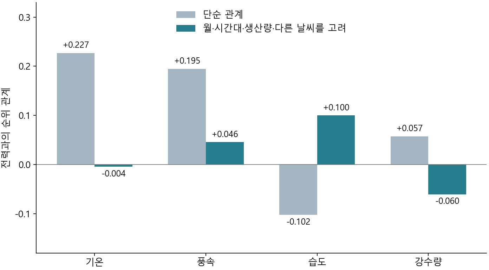

# A03 / 3.3 생산 조건을 고려한 날씨·전력 관계

## 이전 근거와 이번 질문

[현재 EDA 원고](../EDA/02_EDA_원고.md) 2.3에서 8월 기온·평균 전력의 순위 상관은 전체 −0.076이었으나, 생산량 양수 383시간에서는 +0.599였다. 또한 평일의 낮은 전력 기록 747시간 중 92시간은 생산량이 양수였다. 생산량 0과 낮은 전력을 같은 상태로 취급하거나, 전체 상관 하나로 날씨 관계를 설명하기 어렵다.

이번 질문은 **월·시간대·생산 기록을 고려한 뒤에도 날씨와 전력의 관계가 남는가, 8월의 강한 양의 관계는 어느 범위에서 나타나는가**다. 3.1의 생산 전환과 전력 변동, 3.2의 과거 전력 정보 분석을 보완하되, 예측 모형을 새로 학습하지 않는다.

실행 전에 [분석 조건](tables/a03_conditioned_weather/contract.json)을 고정했다. 전체 관계가 약해져도 특정 월에서 관계가 남으면 월별 방향과 날짜 사이·날짜 안의 차이를 확인한다. 유리한 월이나 관측값만 골라 결론을 강화하지 않는다.

## 자료와 비교 방법

- 원본: `data/origin/okm_augumented_2021.csv`. 2021년 1~8월 정상 날짜 241일, 5,784시간. 전력은 같은 행의 네 15분 값으로 계산한 반올림 전 평균이다.
- 주 분석: 평일 171일, 4,104시간. 네 기상변수가 모두 있는 **동일한 4,102시간**에서 보정 전후를 비교한다. 제외된 2시간은 풍속 결측이며, 생산량 0이나 낮은 전력은 제외하지 않는다.
- 보정 전: 각 기상변수와 전력의 Spearman 순위 상관.
- 보정 후: 월×시간대 조건, 생산량 0/양수 여부와 생산량 순위의 1~3차 항, 나머지 세 기상변수의 순위를 함께 고려한 뒤 남은 순위 관계. 보정 집단에는 서로 다른 날짜가 3일 이상 있어야 한다. 전체 날짜 비교에서는 평일/주말도 달력 조건에 포함한다.
- 보조 점검: 생산량 양수/0, 전체 정상 날짜, 월별·월 하나씩 제외, 동일 하루 전력 배열에 대한 역빈도 가중. 월별 결과 차이 때문에 생산량 조정 방식, 주 하나씩 제외, 날짜별 차이를 추가 확인했다.

‘고려한 뒤’는 해당 변수들로 설명되는 순위 차이를 제거하고 남은 관계를 비교했다는 뜻이다. 무작위 실험이나 인과효과 추정이 아니며, 관계가 0에 가깝다는 결과로 모든 비선형 관계나 예측 가치를 부정할 수 없다. 같은 시간의 생산량·날씨는 여기서는 관측 관계를 설명하는 조건이고, 미래예측에 미리 넣을 수 있는 정보라는 뜻이 아니다. 반복 시간 기록을 독립 표본으로 가정한 유의확률은 제시하지 않는다.

## 결과 1: 전체 기간의 날씨 관계는 조건을 고려한 뒤 약했다

| 기상변수 | 보정 전 순위 관계 | 조건을 고려한 뒤 |
|---|---:|---:|
| 기온 | +0.227 | −0.004 |
| 풍속 | +0.195 | +0.046 |
| 습도 | −0.102 | +0.100 |
| 강수량 | +0.057 | −0.060 |

두 열 모두 평일 4,102시간이다. 보정 전 단순 상관과 보정 후 부분 순위 관계를 비교했으며, 예측 정확도를 뜻하지 않는다. 기온·풍속의 양의 관계가 크게 약해졌고 습도·강수량은 방향도 달라졌다. 따라서 단순 관계를 해당 날씨 변수만의 효과로 해석할 수 없다.

단계별 기온 관계는 관측 가능한 평일 4,104시간에서 +0.227 → 월·시간대 고려 −0.093 → 생산 기록도 고려 −0.016이었다. 다른 기상변수까지 고려한 동일 완전 관측 4,102시간에서는 −0.004였다. 마지막 단계의 두 결측 기록 차이를 보정 효과로 혼동하지 않도록 위 표와 그림은 동일한 4,102시간으로 다시 계산했다.

같은 하루 전력 배열이 여러 날짜에 반복된 영향을 줄이는 가중 점검에서도 기온 −0.042, 풍속 +0.034, 습도 +0.098, 강수량 −0.044였다. 월을 하나씩 제외한 기온 관계는 −0.040~+0.014였으며 나머지 세 변수도 크기가 작았다. 전체 정상 날짜 5,780시간에서는 기온 +0.006, 생산량 양수인 평일 3,059시간에서는 +0.033이었다. 전체 기간에서 일관된 강한 기온·전력 관계가 있다는 결론은 지지되지 않았다.

근거: [동일 기록 비교](tables/a03_conditioned_weather/common_row_associations.csv), [전체 조건별 결과](tables/a03_conditioned_weather/associations.csv), [월 제외](tables/a03_conditioned_weather/leave_month_out.csv), [표본 수](tables/a03_conditioned_weather/sample_counts.csv).

## 결과 2: 생산량 양수 기록에서도 월별 방향은 달랐다

다음은 생산량이 양수인 평일의 기온 관계다. 모든 월에서 같은 방법을 사용했다. ‘날짜 차이도 고려’는 날짜별 공통 수준 차이를 추가로 제거한 비교다.

| 월 | 비교 시간 / 날짜 | 월·시간대·생산·다른 날씨 고려 | 날짜 차이도 고려 |
|---|---:|---:|---:|
| 1월 | 234 / 12일 | +0.333 | +0.051 |
| 2월 | 378 / 18일 | −0.128 | −0.175 |
| 3월 | 355 / 17일 | +0.237 | −0.042 |
| 4월 | 447 / 22일 | −0.030 | +0.028 |
| 5월 | 403 / 21일 | −0.231 | −0.057 |
| 6월 | 467 / 22일 | +0.069 | +0.053 |
| 7월 | 415 / 20일 | +0.061 | −0.027 |
| 8월 | 360 / 17일 | +0.302 | +0.014 |

1·3·8월의 양의 관계와 2·5월의 음의 관계가 함께 나타났다. 생산량 조정을 순위의 1차 항만 사용하는 방식으로 바꿔도 주요 수치는 비슷했다. 예를 들어 8월은 +0.302 → +0.299로 유지됐다. 따라서 생산량 조정 항의 선택만으로 월별 방향 차이가 생겼다고 보기 어렵다.

7월 기온 관계는 달력·생산 조건 고려 후 +0.307에서 다른 날씨까지 고려하면 +0.061로 약해졌다. 같은 달의 달력·생산 조건을 고려한 기온·습도 관계는 −0.742였다. 이처럼 함께 변하는 날씨가 있어 단일 기상변수의 관계를 독립적인 물리적 효과로 특정하기 어렵다.

근거: [월별 전체 결과](tables/a03_conditioned_weather/monthly.csv), [월별 기온 진단](tables/a03_conditioned_weather/temperature_monthly_diagnostics.csv), [기상변수 동반 변화](tables/a03_conditioned_weather/conditional_temperature_weather.csv).

## 결과 3: 8월의 양의 관계는 날짜 사이 차이를 포함한 결과였다

EDA의 8월 생산량 양수 전체 383시간에서는, 이번 반올림 전 평균으로 계산한 단순 기온 관계가 +0.599였다. 달력·생산·다른 날씨를 고려한 비교 가능한 381시간·20일에서는 +0.286이었다. 평일만 보면 360시간·17일에서 +0.302였다. 두 결과는 비교 날짜가 다르므로 서로 같은 집단의 수치로 쓰지 않는다.

평일 생산량 양수 기록에 날짜별 차이를 추가로 고려하면 **+0.302 → +0.014**로 약해졌다. 즉, 8월의 관계를 같은 날 안에서 기온이 오를 때 전력이 같이 오르는 패턴으로 설명하기는 어렵다. 기온이 높은 날짜와 전력이 높은 날짜가 겹치는 차이가 중요한 부분이었다.

다만 날짜별 차이를 제거하면 실제 날씨의 날짜 간 변동도 함께 제거된다. 따라서 이것은 ‘날씨 효과가 없다’거나 ‘날짜가 전부 원인이다’라는 증거가 아니다. 현 자료로 해당 날짜들의 운영 원인은 식별하지 못하며, 날짜 사이 관계와 날짜 안 관계를 구분하는 데서 해석을 종료한다.

8월의 주를 하나씩 제외한 조건부 관계는 +0.069~+0.374였다. 방향은 양수였으나 크기는 달라졌고, 이를 전체 월에 통용되는 강한 관계로 일반화하지 않는다. 날짜별 양수 생산 시간의 평균끼리 비교한 보조 관계는 +0.444였지만, 날짜마다 포함된 시간 구성이 달라 주 결과를 대신하지 않는다.

근거: [주 제외 진단](tables/a03_conditioned_weather/temperature_leave_week_out.csv), [날짜별 보조 결과](tables/a03_conditioned_weather/daily_temperature_relations.csv), [진단 조건](tables/a03_conditioned_weather/diagnostic_contract.json).

## 판단 갱신과 3.1~3.3의 연결

**확인된 사실:** EDA에서 보인 기온 관계는 생산·달력·함께 변하는 날씨에 따라 크게 달라졌다. 전체 기간의 조건부 관계는 약했으며, 일부 월에 남은 양의 관계도 날짜 안의 상승 관계와 구분해야 했다.

**유지하는 해석:** 전체 상관만으로 날씨와 전력을 설명할 수 없다는 EDA 판단은 유지한다. 날씨 관계를 분석하려면 생산 기록과 시기를 함께 봐야 한다.

**수정하는 해석:** 8월 생산량 양수 기록의 +0.599를 보편적인 기온 효과나 강한 예측 근거로 내세우지 않는다. 날씨를 추가하면 예측이 크게 개선된다는 성과도 아직 없다. 날씨를 무조건 제외해야 한다는 결론 역시 내리지 않는다.

**남은 질문:** 분석을 예측으로 연결했을 때, 전력 변동이 큰 시점의 오차와 과소예측을 안정적으로 줄일 수 있는가?

3.1은 생산량 0→양수 전환에서 전력 변화가 더 크다는 평가 맥락을 제공했다. 3.2에서는 달력 정보보다 과거 전력 수준이 전환 구분에 훨씬 많은 정보를 주었고, 관측을 마친 시간 안의 변화는 다음 평균 변화와 연결됐다. 반면 전환 확률을 전력 예측에 연결한 선행 실험의 성과는 일관되지 않았다. 3.3에서 날씨의 강한 보편적 관계도 확인하지 못했다.

따라서 현재 가장 근거가 있는 후보는 **직전 평균 전력과 네 15분 값의 변화를 함께 사용해 다음 시간 전력 변화를 예측하고, 전체 오차뿐 아니라 실제 상승을 작게 예측하는 문제를 줄이는 접근**이다. 시간 안의 변화가 전환 자체를 잘 구분한다는 주장은 하지 않는다. 이것은 예측 검증할 후보이며, 차별적 성과가 입증된 ‘필살기’로 확정하지 않는다.

다음 단계는 Modeling에서 예측 시점에 관측을 마친 과거 전력 입력을 비교하는 것이다. 동일한 시간순 평가에서 평균 전력만 사용하는 기준과 네 15분 값의 변화도 사용하는 후보를 비교하고, 전체 절대오차 및 실제 상승량 대비 예측 상승량의 부족분을 연속값으로 평가한다. 생산 전환은 사후 오류 진단에만 사용하고, 목표 시간의 실제 생산량·실측 날씨를 입력으로 넣지 않는다. 날씨의 추가 가치는 그 시점에 이용 가능한 과거 날씨만으로 별도 비교할 수 있다. 이미 살펴본 마지막 평가 구간을 새 독립 시험이라고 부르거나 그 결과에 맞춰 반복 조정하지 않는다.

이 기록으로 승인된 3.3의 날씨 관계 질문은 종료한다. 강한 관계를 얻기 위한 추가 조건 탐색은 하지 않는다. **3.3 원고와 새로운 예측 학습은 이번 작업에 포함하지 않았다.**

## 실행·검증

- [주 분석 코드](scripts/a03_conditioned_weather.py), [차이 진단 코드](scripts/a03_weather_diagnostics.py), [그림 코드](scripts/plot_a03_weather.py)를 정규 CPython 3.13으로 실행했고 모두 종료 코드 0이었다.
- 원본 5,784시간의 네 전력값 평균·생산량·날씨를 독립 CSV 읽기와 대조했다. EDA의 반올림된 평균을 사용한 8월 상관도 재현했다. 반올림 전 평균을 사용한 이번 분석과의 작은 차이를 확인했다.
- 달력별 잔차 계산은 1월 평일 자료에서 명시적인 더미 변수를 사용한 가중 최소제곱 결과와 대조했다. 이 검증은 계산 일치 확인이며 모형의 인과적 타당성 검증이 아니다.
- 진단 입력의 해시가 유지됐고 결과 파일 해시를 기록했다. 그림은 50% 축소본에서 축·범례·값·잘림을 확인했다.
- 원본 SHA-256: `8f7af2e49366c93e1d6f5fdef4b5e350066c1792ac463c2c2886e370f4674830`. 백업과 이전 분석·모델 결과는 사용하지 않았다.
- [주 분석 검증](tables/a03_conditioned_weather/verification.json), [진단 검증](tables/a03_conditioned_weather/diagnostic_verification.json), [그림 검증](tables/a03_conditioned_weather/figure_verification.json).
