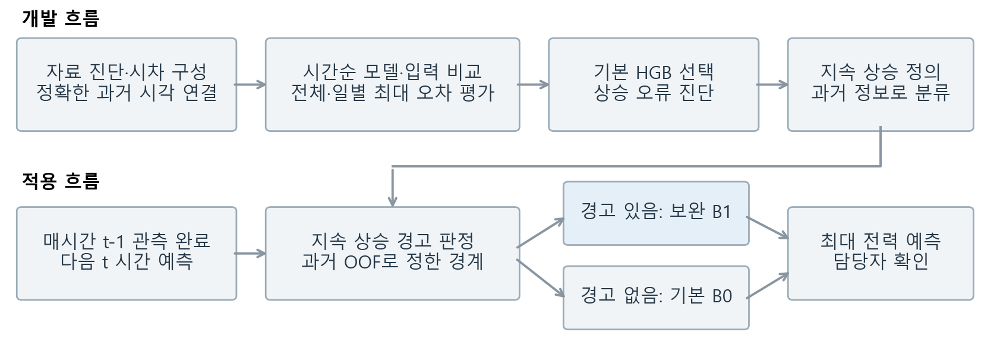
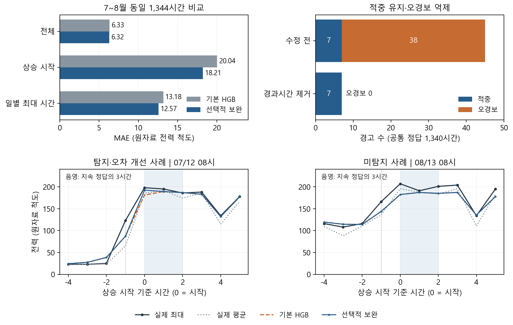

# 4. Modeling

## 4.1 시간순 평가와 기본 모델 선택

Analysis에서 확인한 시간 내부 전력 차이를 반영해 **다음 한 시간의 네 15분 값 중 최대값**을 예측했다. 직전 관측까지의 전력·생산량과 달력을 사용하고, 시간 오류·공백은 정확한 시차 연결로 처리했다. 무작위 분할 대신 1~3월→4월, 1~4월→5월, 1~5월→6월로 평가했으며 Optuna 튜닝도 각 평가 월 이전의 내부 시간순 검증에서 수행했다.

*그림 1. 위는 개발, 아래는 관측 시점에 맞춘 적용 흐름이다. OOF는 해당 평가 월 이전 자료로 학습한 모델의 예측이다.*

Ridge·Elastic Net·SVR, HGB·XGBoost·LightGBM·CatBoost·ExtraTrees와 앙상블을 비교했다. 같은 기본 입력·2,184시간에서 대표 결과는 다음과 같다.

| 모델 | 전체 MAE | 일별 최대 시간 MAE |
|---|---:|---:|
| 직전 값 기준 | 13.793 | 36.589 |
| HGB | **6.738** | 11.751 |
| ExtraTrees | 6.825 | **11.540** |
| XGBoost | 7.131 | 12.864 |

**전체·최대 시간 오차를 함께 보는 사전 선택 규칙에 따라 HGB를 유지했다.** 마지막 15분 값 추가는 개발에서 유리했지만 후반기 최대 시간까지 개선이 유지되지는 않았다. 이에 전력 수준이 크게 올라 유지되는 시작을 따로 예측하고, 그때만 HGB를 보완했다.

관련 Python: [시차 구성](scripts/m01_prepare.py) · [시간순 모델 비교·튜닝](scripts/m02_rerun.py) · [입력 효과](scripts/m03_ablation.py). 그림 1 생성: [modeling_close_figures.py](scripts/modeling_close_figures.py)의 `pipeline()`.

## 4.2 지속 상승 예측과 선택적 HGB 보완

시간 산술평균이 직전 값과 과거 6시간 중앙값보다 각각 59.5 이상 높고, 중앙값 대비 상승폭이 과거 IQR의 1.5배 이상인 시작을 후보로 삼았다. 이후 3시간 동안 기존 기준선보다 29.75 이상 높은 상태가 이어지면 **지속 상승**으로 정의했다. 1월 자료에서 정한 분석 기준이며, 미래 3시간은 정답 확인에만 사용했다.

Logistic이 과거 정보로 상승을 경고할 때만 상태 입력을 보완한 HGB B1을 적용하고 나머지는 기본 HGB B0를 유지했다. 초기 오경보 38건은 모두 상태 경과시간이 학습 최대 64시간을 넘어선 180~227시간에서 발생했다. **분류기의 경과시간 입력 하나를 제거**하고 과거 OOF에서 경계 0.4555를 정하자 개발 적중 12건·오경보 0건을 유지했다.

*그림 2. 7~8월 탐색적 재평가. 위: 동일 1,344시간의 오차와 정답이 확인된 1,340시간의 경고 수. 일별 최대는 완전한 56일을 같은 가중치로 평가했다. 아래: 개선·미탐지 사례; 음영은 지속 정답 3시간, 점선은 직전 관측 완료 시점이다.*

상승 시작 MAE는 **20.037→18.205(9.1% 감소)**, 평균 과소예측은 **19.419→16.342(15.8% 감소)**, 일별 최대 시간 MAE는 13.179→12.574(4.6% 감소)였다. 전체 MAE는 6.335→6.317로 0.28% 줄었다. 보완은 7시간에만 적용했고 적중 7건을 유지하면서 오경보를 38→0건으로 줄였다.

분류는 1~6월 4,336시간, 회귀는 2~6월 3,598시간으로 한 번 학습해 7~8월에 고정했다. 매시간 입력만 갱신했으며 7월 정답으로 재학습하지 않았다. 이미 확인한 후반기 결과를 바탕으로 수정했으므로 독립 최종시험이 아닌 탐색적 결과다.

관련 Python: [사건 정의](scripts/regime_diagnose.py) · [분류](scripts/regime_forecast.py) · [보완 HGB](scripts/regime_integrate.py) · [선택 결합](scripts/regime_route.py) · [고정 평가](scripts/regime_followup.py) · [경과시간 제거](scripts/regime_age_ablation.py). 그림 2 생성: [modeling_close_figures.py](scripts/modeling_close_figures.py)의 `compact_evidence()`.

## 4.3 오류 해석·현장 활용과 재현성

공통 상승 13건 중 7건을 탐지해 **정밀도 100%(7/7), 재현율 53.8%(7/13)**였다. 경고 7건 중 값의 오차는 4건에서 줄고 3건에서 늘었다. 그림 2의 7/12는 실제 최대 198에 대해 181.13→192.52로 개선됐지만, 8/13은 경고가 없어 실제 207을 182.40으로 낮게 예측했다. 각 사례는 개선폭·실제 최대값의 중앙 순위로 선정했다.

표준화 입력×계수로 Logistic의 로짓을 분해하면 적중·미탐지의 과거 전력 평균 기여는 13.86·4.16이었다. 과거 전력도 판단에 기여했지만 경고는 모두 월요일 08시에 집중됐다. 사후 단순 주간 규칙은 8건 적중·오경보 1건이고 일별 최대 오차는 같아 추가 이득은 작았다. 성과는 **지속 상승 일부에서 오경보를 억제하고 과소예측을 줄인 선택적 보완**이며, 양방향 전환 전체의 탐지로 확대하지 않는다.

현장에서는 직전 관측 완료 후 최대 전력·상승 경고를 확인하고, 담당자가 예정된 가동·동시 사용 조건과 함께 보완 예측을 검토한다. 무경고를 안전 판정으로 쓰지 않으며 필수 시차가 없으면 보완을 보류한다. 가동 조정과 전력·비용 절감은 실측 성과가 아닌 활용 제안이다.

원자료부터 현재 고정 방법을 재실행해 분류 1,428개·회귀 4,032개 예측의 일치를 확인했다. 관련 Python: [원자료 재현·변수 기여·사례 선정](scripts/modeling_close_analysis.py) · [주간 규칙 대조](scripts/regime_age_calendar_control.py) · [한 번에 재현](scripts/modeling_reproduce_selected.py) · [수치·그림·링크 검증](scripts/modeling_close_verify.py). 정규 CPython 3.13에서 재현 스크립트에 `--output-dir Modeling/reproduction_new`로 새 폴더를 지정한다.

전체 실행 명령·단계별 검증 코드·근거표는 [상세 원고 4.5·4.12·4.13](04_Modeling_원고.md), 전체 파일 목록은 [제출 보존 목록](submission_manifest.json), 환경은 [requirements.txt](requirements.txt)에 연결했다. 새 환경 설치와 과거 Optuna 전체 재탐색을 검증한 것은 아니다.
