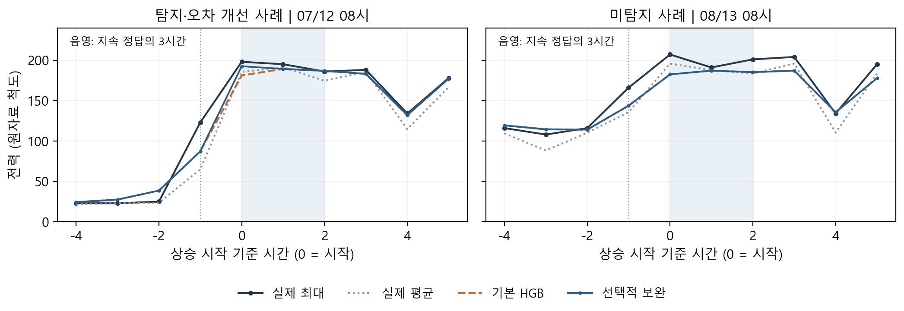

# 제3장. 영향요인 및 오류분석

제2장의 선택적 HGB 보완은 지속 상승 일부에서 과소예측을 줄였다. 초기 상승 분류기의 오경보 38건은 모두 상태 경과시간이 학습 범위의 최대 64시간을 넘는 180~227시간에서 발생했다. 이 입력을 분류기에서 제거한 결과, 공통 평가 1,340시간에서 적중 7건을 유지하면서 오경보가 0건으로 줄었다. 상승 13건 중 6건은 놓쳐 정밀도는 100%(7/7), 재현율은 53.8%(7/13)였다.

*그림 3-1. 7~8월의 개선·미탐지 사례. 음영은 지속 상승 정답의 3시간, 세로 점선은 직전 관측 완료 시점이다. 개선 4건의 개선폭과 미탐지 6건의 실제 최대값을 각각 정렬해 중앙 순위 사례를 선정했다.*

7월 12일 08시 실제 최대값 198에 대해 예측은 181.13에서 192.52로 개선됐다. 반면 8월 13일은 경고가 없어 실제 207을 182.40으로 낮게 예측했다. 경고 7건 중 개별 값의 오차가 감소한 것은 4건이었다.

Logistic의 표준화 입력과 계수를 곱해 판단 근거를 분해했을 때, 적중·미탐지의 과거 전력 평균 로짓 기여는 각각 13.86·4.16이었다. 과거 전력도 판단에 기여했지만 경고는 모두 월요일 08시에 집중됐다. 이는 모델 계산의 설명이며 공정 원인의 규명은 아니다. 또한 이미 확인한 후반기 결과를 바탕으로 수정했으므로, 본 결과는 탐색적 재평가로 해석한다.

이미지·생성 코드: [그림 파일](../Modeling/figures/modeling_close/transition_cases.png) · [modeling_close_figures.py](../Modeling/scripts/modeling_close_figures.py)의 `cases()`. 수치·사례 선정 근거는 [장별 코드·결과 연결](README.md)에 정리했다.

# 제4장. 현장 활용방안

## 4.1 예측값을 확인할 시점과 판단 목적

본 모델은 **다음 한 시간에 예상되는 최대 전력과, 전력 수준이 크게 올라 유지되기 시작할 가능성을 함께 확인하는 업무**에 활용할 수 있다. 최대값 예측은 부하의 크기를 검토하는 데, 지속 상승 경고는 가동 상태가 바뀌는 시점에 주의를 기울이는 데 사용한다. 생산량이 0이어도 전력이 관측됐던 데이터 특성을 고려해, 생산량만으로 저부하나 휴무를 판정하지 않고 최근 전력 관측을 함께 확인한다.

적용 시점은 직전 시간의 관측이 완료된 직후다. 최근 전력·생산량과 달력 정보를 갱신해 다음 시간의 예측값과 경고를 산출한다. 이는 매시간 갱신하는 다음 한 시간 예측이며, 상승이 발생하기 정확히 한 시간 전에 경고가 제공된다는 보장은 아니다. 경고는 분석에서 정의한 지속 상승 가능성을 뜻하며, 설비의 허용 전력이나 요금 기준 초과 여부를 직접 판정하지 않는다.

## 4.2 담당자의 확인과 조치 검토

현장 적용 시 담당자가 확인할 항목으로 예측 대상 시간, 최근 관측 전력, 다음 시간 최대값, 지속 상승 경고, 기본·보완 모델 적용 여부를 제안한다. 판단과 조치는 다음과 같이 연결한다.

| 확인 결과 | 담당자의 판단과 조치 검토 |
|---|---|
| 지속 상승 경고 발생 | 보완 HGB의 최대값 예측과 예정된 가동을 함께 확인한다. 가동 시작이 겹치는지 살펴보고, 생산 일정과 공정 제약이 허용하는 작업의 시작 시점 분산을 검토한다. |
| 경고 없음 | 기본 HGB의 최대값 예측을 계속 확인한다. 전환 경고가 없어도 높은 부하가 유지될 수 있으므로 경고 유무만으로 점검을 종료하지 않는다. |
| 필수 시차 입력 누락 | 해당 예측을 판단 근거로 사용하지 않고 자료 상태를 표시하도록 제안한다. 이전 예측을 현재 시점의 정상 예측처럼 제시하지 않는다. |

예정된 가동은 담당자가 조정 가능성을 판단할 때 사용하는 정보이며, 이번 모델의 입력 자료는 아니다. 개별 설비의 소비전력이나 공정 제약은 현재 자료에서 식별되지 않으므로 특정 설비를 정지하거나 생산량을 줄이라는 자동 지시로 연결하지 않는다. 조정 여부는 담당자가 결정하고, 다음 관측 시점에 실제 전력과 예측을 함께 확인하는 활용 절차를 제안한다.

## 4.3 분석 성과가 활용에 기여하는 범위

상승 시작의 과소예측 감소는 실제보다 낮은 부하를 예상해 준비가 부족해지는 상황을 줄이는 방향의 성과다. 오경보 감소는 불필요한 확인 요청을 줄이는 데 연결할 수 있다. 다만 공통 상승 13건 중 6건을 놓쳤으므로 기본 예측과 담당자 확인을 병행해야 한다. 본 연구에서 확인한 성과는 예측오차와 경고의 개선이며, 위 절차의 현장 적용·자동 제어·전력 및 비용 절감량은 검증하지 않았다.

# 제5장. 창의성 및 차별성

## 5.1 전력의 크기와 지속 전환을 함께 다룬 문제 설계

EDA·Analysis에서는 낮은 전력이 이어지는 구간과 시간 내부의 전력 차이를 확인했다. 이 관찰을 바탕으로 모델링에서는 다음 시간의 최대 전력을 예측하면서, 높은 수준이 여러 시간 유지되기 시작하는 사건을 별도로 정의했다. **“얼마나 높은가”와 “높은 상태로 바뀌기 시작하는가”를 함께 다룬 점**이 분석과 활용을 연결한다. 같은 최대값이라도 지속 전환 여부에 따라 담당자가 확인할 상황이 달라지기 때문이다.

지속 여부는 미래 관측으로 정답을 구성하되, 예측에는 직전까지 확인된 정보만 사용했다. 이를 통해 사후에 관측된 전력 변화를 설명하는 분석을 실제 예측 시점의 질문으로 옮겼다. 상승 경고와 최대값 예측의 역할을 구분한 설계는 제4장의 가동 시작·동시 사용 검토 절차로 이어진다.

## 5.2 필요한 시간에만 예측을 보완한 기여

기본 HGB를 유지하면서 상승 경고가 발생한 시간에만 상태 입력을 보완한 HGB를 적용했다. 7~8월 공통 1,344시간 중 7시간에 보완을 적용했고, 나머지 1,337시간은 기본 예측을 유지했다. 그 결과 상승 시작 MAE는 9.1%, 평균 과소예측은 15.8%, 일별 최대 시간 MAE는 4.6% 감소했다. 전체 MAE의 감소는 0.28%였으므로, 성과의 중심은 전체 평균의 큰 개선보다 **상승 시작과 최대 시간의 오차를 줄인 데** 있다.

이러한 선택적 보완은 기존 예측 체계를 유지하면서 특정 조건의 오류를 다룰 수 있다는 점에서 활용 의미가 있다. 다만 경고가 발생한 모든 사례에서 값의 오차가 줄어든 것은 아니며, 적용 효과는 제3장의 개별 사례와 전체 집계로 구분해 판단했다.

## 5.3 오류 원인을 입력 설계와 적용 범위에 반영

초기 오경보가 장기간 지속된 상태에서 발생한다는 점을 확인하고, 학습 범위를 넘어선 경과시간 입력 하나를 상승 분류기에서 제거했다. 기존 적중 7건을 유지하면서 오경보 38건을 없앤 결과는, **관측된 실패조건을 진단하고 그 근거로 방법을 수정한 기여**를 보여준다. 이는 담당자가 확인해야 할 경고를 줄이려는 제4장의 목적과도 연결된다.

현재 성과는 일부 지속 상승에 대한 탐색적 결과다. 경고는 월요일 08시에 집중됐고, 사후 단순 주간 규칙도 8건 적중·오경보 1건을 보였으며 일별 최대 오차는 같았다. 따라서 주간 규칙 대비 추가 이득은 제한적이다. 본 연구의 결론은 **기본 전력 예측에 지속 상승 판정을 결합하고, 오류 진단을 통해 불필요한 경고를 줄이면서 일부 상승의 과소예측을 완화했다는 것**이다. 이를 현장에서 검토 가능한 예측값과 확인 시점으로 구체화한 데 제안의 의의가 있다.
